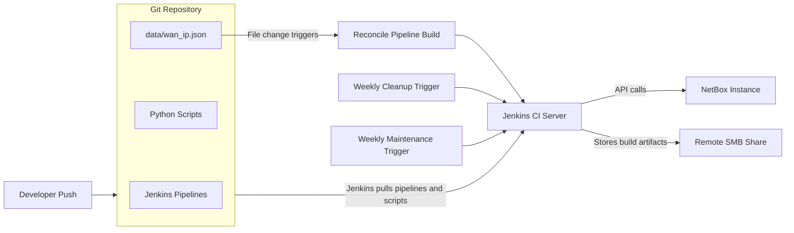

# Jenkins + Git + NetBox + SMB Artifacts Architecture



# WAN IP Ingestion, Cleanup & Storage maintenance

## Overview

There are 3 pipelines:

1. **`Jenkinsfile.reconcile`** - executes WAN IP reconcilation workflow.
2. **`Jenkinsfile.cleanup`** - executes WAN IP cleanup workflow.
3. **`Jenkinsfile.maintenance`** - executes maintenance script to remove old build artifacts from the SMB share.

Above pipelinces collectively depends on **two core scripts**, **one optional validation script** & **one helper maintenance script**:

1. **`ingest_wan_ip.py`** – main worker script responsible for ingesting and reconciling WAN IP data.
2. **`clean_deprecated_wan_ip.py`** – cleanup script for removing deprecated WAN IPs.
3. **`netbox_ping.py` (optional)** – validation script for reachability checks.
4. **`maintenance_smb.py`** - prunes SMB share which hosts artifacts collected by other scripts.

---

## Script 1: `ingest_wan_ip.py`

> [!NOTE]
> This script is executed by the `Jenkinsfile.reconcile` pipeline.

Compares WAN IP data from an external Source of Truth (SoT) with NetBox and reconciles differences.

### Data Sources

The script operates on two datasets:

- **Dataset A** – WAN IPs sourced from a JSON file stored in GitHub.
- **Dataset B** – Existing IP address objects in NetBox.

---

### Dataset A – Sample JSON Structure (GitHub)

```json
{
  "meraki": [
    {
      "ip": "52.14.210.88",
      "infrastructure_type": "Cloud",
      "provider": "AWS",
      "region": "us-east-2",
      "environment": "Production",
      "purpose": "Public Facing Load Balancer",
      "caption": "AWS-ELB-001"
    }
  ],
  "aruba": [
    {
      "ip": "198.51.100.42",
      "infrastructure_type": "Datacenter",
      "provider": "Equinix-Colocation",
      "region": "Chicago-CH3",
      "environment": "Production",
      "purpose": "Primary Edge Firewall (Cisco ASA)",
      "caption": "DC-FW-01-PRI"
    }
  ]
}
```

Each top-level key represents a **platform** (e.g., `meraki`, `aruba`).

---

### Dataset B – Sample NetBox IP Object

```json
{
  "id": 15560,
  "address": "172.16.32.163/16",
  "status": {
    "value": "deprecated",
    "label": "Deprecated"
  },
  "description": "Auto-generated",
  "tags": [
    {
      "name": "phpipam-migrated",
      "slug": "phpipam-migrated"
    }
  ],
  "custom_fields": {},
  "created": "2025-08-01T19:24:03.079399Z",
  "last_updated": "2025-08-01T19:24:03.079411Z"
}
```

---

### Data Normalization & Mapping

A new working dictionary is built from **Dataset A**, containing only fields relevant to NetBox.

#### Property Mapping

| Dataset A                    | Dataset B     |
| ---------------------------- | ------------- |
| `ip`                         | `address`     |
| `caption`                    | `description` |
| platform (`aruba`, `meraki`) | NetBox tag    |
| raw data                     | `comment`     |

> We are punting raw data for the IP from A as a comment for audit and troubleshooting purposes.

#### Additional NetBox Metadata

Create these in NetBox before the workflow goes live.

- **Tags**
  - `External SoT GitHub`
  - `Review-Required`
- **Custom Field**
  - `last_seen` – Timestamp of when the IP was last observed in Dataset A.

---

### Reconciliation Logic

#### Case 1: Exists in A but not in B
- Create IP in NetBox
  - Tag: `External SoT GitHub`
  - Tag: `Aruba` or `Meraki` or whatever the platform is
  - Set `last_seen`
  - Set `status` to **Active**
  - Punt raw data for the IP from A as a comment.

#### Case 2: Exists in both A and B
- Update IP details
  - Ensure `Status` is set to **Active** if not then set it.
  - If `External SoT GitHub` exists → update `last_seen`
  - If `manual` tag exists → skip
  - Else → tag `Review-Required` and update `last_seen`

#### Case 3: Exists in B but not in A
- If `External SoT GitHub` exists → set status `deprecated`
- Do **not** update `last_seen`

---

### Review Required tag

IPs tagged `Review-Required` are conflicting WAN IPs that have been either added manually or imported from somewhere else (not ingested from Dataset A), so must be manually validated.

To stop these WAN IPs from being marked as `Review-Required` in future runs, remove `Review-Required` tag and add `manual` tag. WAN IPs tagged `manual` are treated as exceptions.

Goal: **single external Source of Truth for WAN IP ingestion**.

---

## Script 2: `clean_deprecated_wan_ip.py`

> [!NOTE]
> This script is executed by `Jenkinsfile.cleanup` pipeline.

Removes deprecated (>90 days) WAN IPs from NetBox.

### Cleanup Logic

1. Fetch IPs with:
   - Tag `External SoT GitHub`
   - Status `deprecated`
2. Validate `last_seen`
3. If `last_seen` > 90 days → delete IP
4. Otherwise retain as `deprecated`

## Script 3: `netbox_ping.py`

> [!NOTE]
> This script is executed by both `Jenkinsfile.reconcile` & `Jenkinsfile.cleanup` pipelines.

Does basic reachability test to NetBox & GitHub.

## Script 4: `maintenance_smb.py`

> [!NOTE]
> This script is executed by `Jenkinsfile.maintenance` pipeline.

All artifacts collected from the reconcilation & cleanup scripts are stored on a remote SMB share (this location can be changed as per your env). This script keeps latest 200 build artifacts (from each pipeline) which should take up about 200-400MB of storage space on remote.


